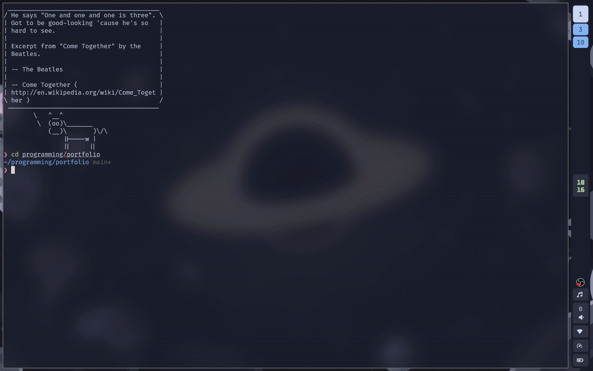

Since past few days, I had been noticing that my inital `<leader> ff` doesn't
open `telescope` file finder. Instead, I have to wait like a second and retry
the shortcut to make it work. I tried to ignore it but over time it has become
an annoying little delay which has ruined the peace of my life. So, I thought of
investigating the issue and try to make it _blazingly fast_ again.

This is my current experience when I open neovim and fail miserably trying to
open `telescope` file finder.



I found a way to time my neovim startup time. From `man nvim`:

```txt
--startuptime file
           During startup, append timing messages to file.  Can be used to diagnose slow startup times.
```

So, running `nvim --startuptime startup.log` I got a 652 line output in
`startup.log` file. The main line is the final line, which is

```txt
130.901  000.004: --- NVIM STARTED ---
```

it shows that my neovim takes about 130ms for the startup. There is also a
a second tool called `:Lazy profile` which claims to be more accurate than
`nvim --startuptime`. According to it, my startup time is 136.13ms.

```txt
Startuptime: 136.13ms

Based on the actual CPU time of the Neovim process till UIEnter.
This is more accurate than `nvim --startuptime`.
  LazyStart 22.35ms
  LazyDone  123.32ms (+100.97ms)
  UIEnter   136.13ms (+12.81ms)
```

Read the full outputs on these pastes:

- [nvim --startuptime startup.log](https://dustebin.com/8ZHw1J7f.css)
- [:Lazy profile](https://dustebin.com/9coAlTHB.sql)

While it surprises me too, ig it is not fast enough because it takes me two
tries to open the file finder. Now you might say something like "why not just
wait half a second after opening neovim?" And to that I say


What's the fun in accepting the easy way out? So, I choose to optimize my neovim
config to make is fast again (maybe i should start calling it MAFA).

The first and probably the easiest way to make your neovim fast is to use lazy
loading. From what I understand of it, lazy loading makes the plugins load when
some specific event is triggered. You can set the event according to your needs
so that the plugins are loaded only when they are needed.

I can sort the plugins by their startuptime in `:Lazy profile` and it seems that
the worst offender is `nvim-cmp` which alone takes around 32ms. Just adding a
simple

```lua
  event = "InsertEnter"
```

makes it load only when I start writing into some file and makes the startup
faster. Similarly, setting event tringgers for some of the most time-taking
plugins drastically reduced my startup time, which is now sitting at a blazingly
fast speed of around 50ms. Thats real gains.

```txt
Startuptime: 40.91ms

Based on the actual CPU time of the Neovim process till UIEnter.
This is more accurate than `nvim --startuptime`.
  LazyStart 7.43ms
  LazyDone  31.74ms (+24.31ms)
  UIEnter   40.91ms (+9.18ms)

```

But I was still having the issue of initial keypresses missing. Digging a little
deeper helps me find that the culprit was `which-key`'s `<leader>` key
registration. It didn't recognize the shortcut until the plugin was loaded
(around 20ms) and my fast ass was already typing by then. So, I moved that
shortcut to run immediately. Something like this

```lua
{
  "folke/which-key.nvim",
  event = "VeryLazy",
  keys = {
    { "<leader>ff", "<cmd>Telescope find_files<CR>", desc = "Find files" },
  },

```

Well, ig the optimization was a by-product. Got from 136ms startup time to just
40ms. Shaved around a 100ms roughly. No biggie
